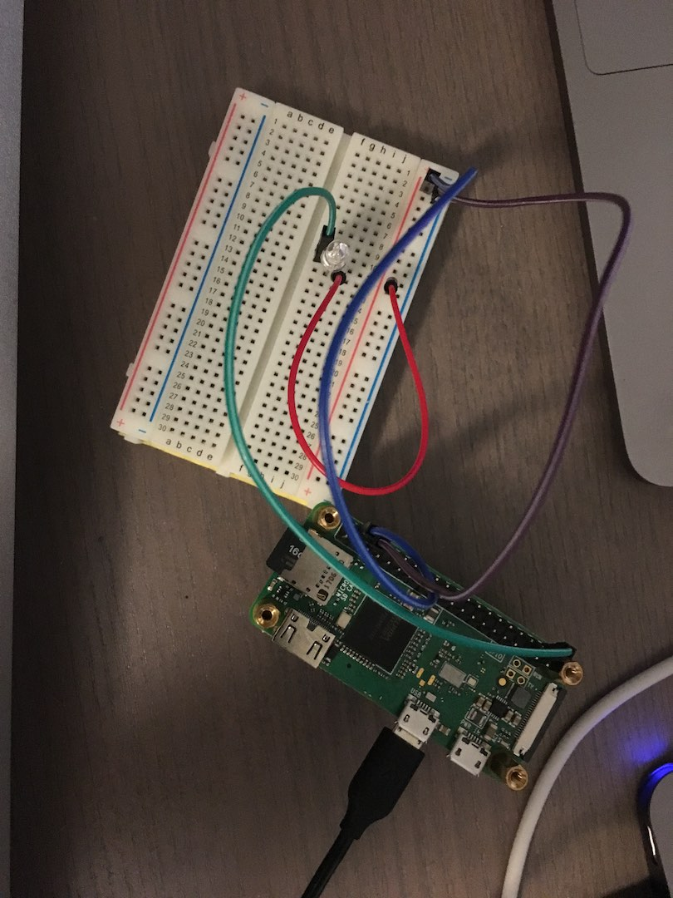
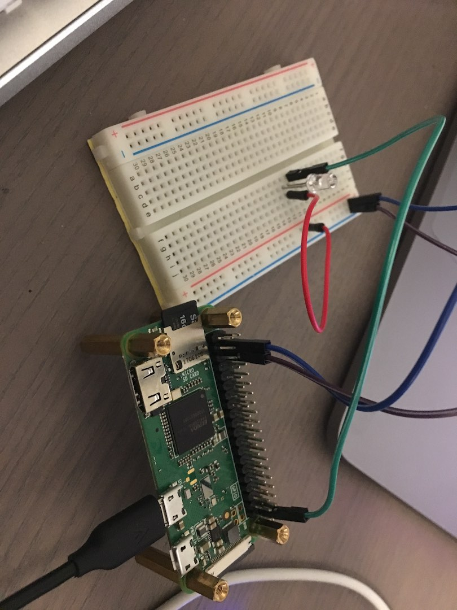
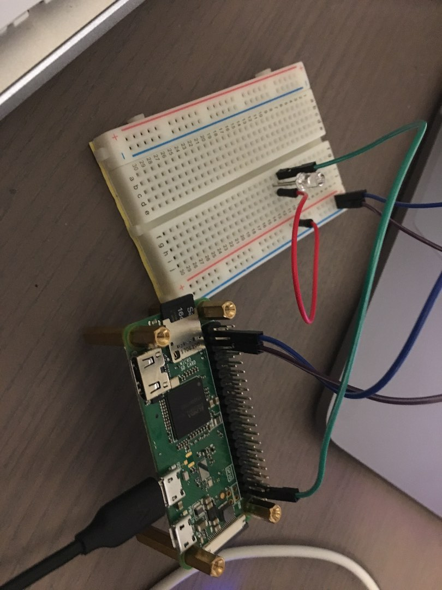
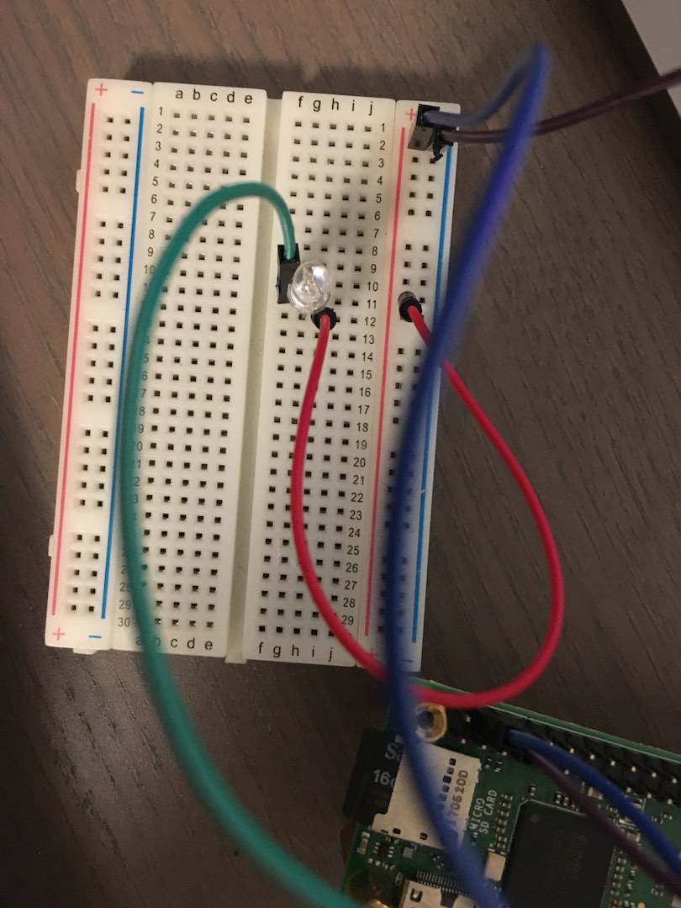
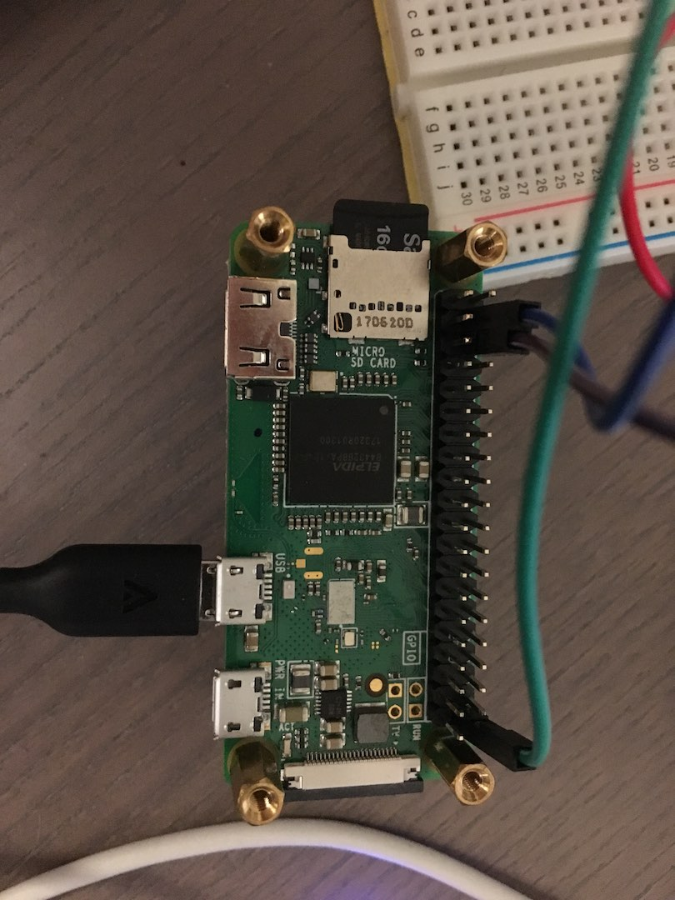

# RemoteLed

This is an example demonstrating how to connect Nerves embedded devices to a
Phoenix server and control the device remotely using websockets.

Using websockets allows controlling devices over a firewalled network since it
can connect to the server over port 80 via TCP, and outgoing connections to port
80 are universally allowed on all home/corporate routers.

## Hardware Requirements for Running the Demo

This example was constructed using a Raspberry PI Zero WH (the wireless version
with headers pre-soldered). 

For easy setup you can use a solderless breadboard to connect the LED to the
different wires.

You will also need an LED, (and maybe a resistor that came with your LED if you
are concerned about frying out your LED, I didn't use one).

Finally some jumper wires, female to male if you have the Zero WH.

Oh and an SD card to burn your firmware to.

Here are a few pictures of my setup:








For the GPIO pin I chose GPIO 21, but if you want to change that you can do so
in the LedWorker modules in the client (firmware) directory under the `@pin`
constant.

## Running Locally

> Note: This guide assumes you have both the Nerves and Phoenix archive
> installed on your machine. If you do not, please consult their respective documentation.
> Also I recommend installing Elixir and Erlang via the excellent asdf version
> manager - be sure to read the asdf-elixir plugin repo's instructions for
> compiling Elixir with an up to date erlang version.

First clone the repository to your machine:

```bash
git clone https://github.com/dkarter/remote_led.git && cd remote_led
```

To connect it to your local network you will need to add your network's SSID and
password to your environment variables like so:

```bash
export NERVES_NETWORK_SSID="mynetwork"
export NERVES_NETWORK_PSK="mypassword"
```

If you are running the device against a locally hosted server on your host
machine, you will need to change the websocket url in the firmware
(`client/config/config.exs`) to the IP of your host machine.

```elixir
config :remote_led, RemoteLed.LedSocket,
  url: "ws://YOUR_IP:4000/socket/websocket",
  serializer: Jason
```

Also make sure to export your `MIX_TARGET`. For this example we will be using
RPi Zero:

```bash
export MIX_TARGET=rpi0
```

Place the Micro SD card in a card reader connected to your computer and run the
following:

```bash
cd client
mix do deps.get, firmware, firmware.burn
```

At the end of this script you will be asked to type your sudo password so that
you can burn the SD card. When the burning is done the SD card will be ejected.
At that point you can remove the card from the card reader and place it in the
Raspberry Pi.

Start the Phoenix server by navigating to the server dir and running `mix
phx.server`:

```bash
cd ../server
mix do deps.get, phx.server
```


## Deploying Server

- [ ] TODO: add instructions for deploying to heroku / digitalocean and pointing
  your device there

